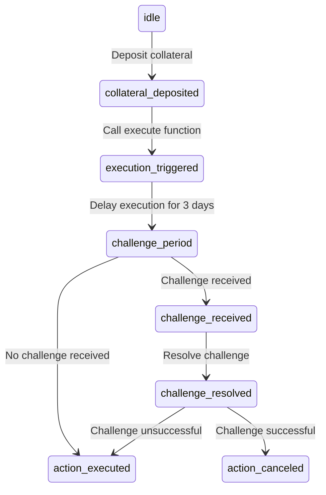

# Introduction

This technical specifications document provides a detailed overview of the `Disputable Admin Plugin`. The `Disputable Admin` is designed to submit `IDao.Actions` for optimistic execution with a delay providing a window for dispute resolution, if required. This mechanism recognises that for the most part, proposals are not controversial and the concensus is known. voting is an expencive (in gas and bandwith) ratification process. `DisputableAdminPlugin` is designed to aleviate the costs around governance by allowing single inderviduals to execute actions on behalf of a DAO with strict guardrails to keep the process safe

## 1.1. Purpose of the Document

The purpose of this document is to serve as a comprehensive guide for developers, auditors, and other stakeholders involved in the development, testing, deployment, and auditing of the `Disputable Admin`. It describes the contract's requirements, architecture, components, data structures, functions, ensuring that all stakeholders have a clear understanding of its design and implementation.

## 1.3. Overview of the Smart Contract

- Configurable delay period:
  The contract allows for the configuration of a custom delay period, providing flexibility to accommodate various use cases and dispute resolution processes.

- Dispute resolution integration:
  The contract is designed to be integrated with a dispute resolution system, such as an arbitration platform or a decentralized court souch as [Nation3 Court]() [Athenic]() or [Kleros]

- Access control and permissions:
  The contract includes a role-based access control mechanism to ensure that only authorized parties can initiate actions and perform administrative tasks.

- Collateral and Slashing conditions:
  The contract manages collateral of both `Executors` and `Disputers`. The funds of the looser is paid to the winner minus the arbitration costs

This document will provide a comprehensive description of the `Disputable Admin`, detailing its requirements, architecture, components, data structures, and functions, as well as the best practices and security measures that have been implemented.

## State Variables

`executionDelay: uint64` - The delay in seconds a user will have to wait before executing a script.
`actionIndex: uint256` - The index of the latest delayed script.
`delayedActions: mapping (uint256 => DelayedAction)` - A mapping to store the delayed scripts by their index.
`minimumCollateral: uint256` -
`adminCollateral: mapping (address => uint256)` -
`hasQuedAction: mapping (address => bool)` -

## Enums

```
`DelayedActionStatus`: Enum to represent the status of a delayed script.
    - `Active`: an delayedAction that has been added to the que.
    - `Paused`: an delayedAction that is being challenged.
    - `Cancelled`: an delayedAction that has been canceled.
    - `RuledAllowed`: an delayedAction that has been allowed by arbitration
    - `RuledDenied`: an delayedAction that has been denied by arbitration
    - `Executed`:  an delayedAction that has been executed.
```

## Structs

```
`DelayedAction`: Struct to represent an array of `[IDao.Action]`.
    - `executionFromTime: uint64`: The timestamp from which the actions can be executed.
    - `pausedAt: uint64`: The timestamp when the actions was paused.
    - `status: DelayedAction Status`: The status of the delayed actions.
    - `actions: IDao.Action[]`: An array of actions to be executed
    - `actionId: uint256`: The action ID associated with the delayed actions.
    - `submitter: address`: The address of the user who submitted the actions.
    - `challenger: address`: The address of the user who challanged the actions.
```

## Roles

`QUE_PROPOSAL_PERMISSION_ID`:
`SET_DELAY_ROLE`: Allows setting the execution delay.
`DELAY_EXECUTION_ROLE`: Allows delaying script execution.
`CANCEL_EXECUTION_ROLE`: Allows canceling script execution.

## Events

`ExecutionDelaySet`: Emitted when the execution delay is set.
`DelayedActionStored`: Emitted when a delayed script is stored.
`ExecutionPaused`: Emitted when script execution is paused.
`ExecutionCancelled`: Emitted when script execution is canceled.
`ExecutedScript`: Emitted when a script is executed.

---



This state diagram represents all the possible states and outcomes for the `DisputableAdminPlugin` It includes the initial state, the collateral deposit, the execution trigger, the challenge period, challenge resolution, and the final outcomes of action execution or cancellation.
